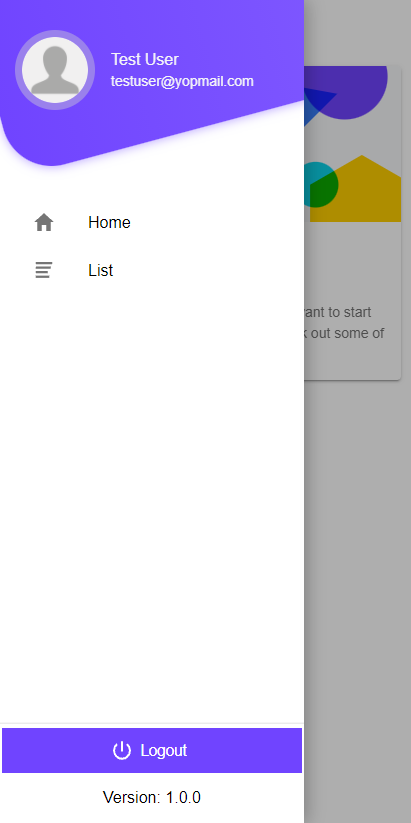
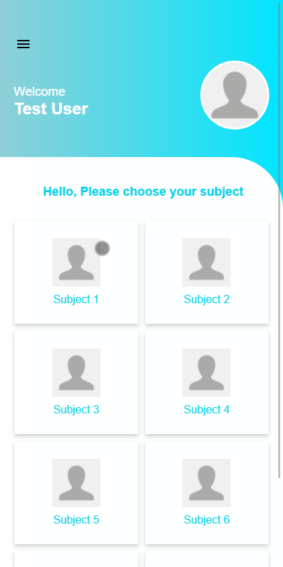

# Menus

## Prerequisites

- [Ionic](https://ionicframework.com/docs/installation/cli/#install-the-ionic-cli)

## Clone Project

```
git clone https://github.com/tbs-raviashara/ionic-menus-demo.git
```

## Screenshots

 &nbsp;
 &nbsp;
 &nbsp;
 &nbsp;
 &nbsp;
 &nbsp;
 &nbsp;

## Start A Local Dev Server

```
ionic serve --open
```

## Add Android Platform

```
ionic cordova platform add android
```

## Build Project

```
ionic cordova build android
```

## Run Application

```
ionic cordova run android
```

## Clean Project

```
npm run clean
```

## How to use

```
git clone https://github.com/tbs-raviashara/ionic-menus-demo.git
cd ionic-menus-demo
npm i or npm install
ionic serve
ionic cordova platform add android
ionic cordova build android
ionic cordova run android
```
